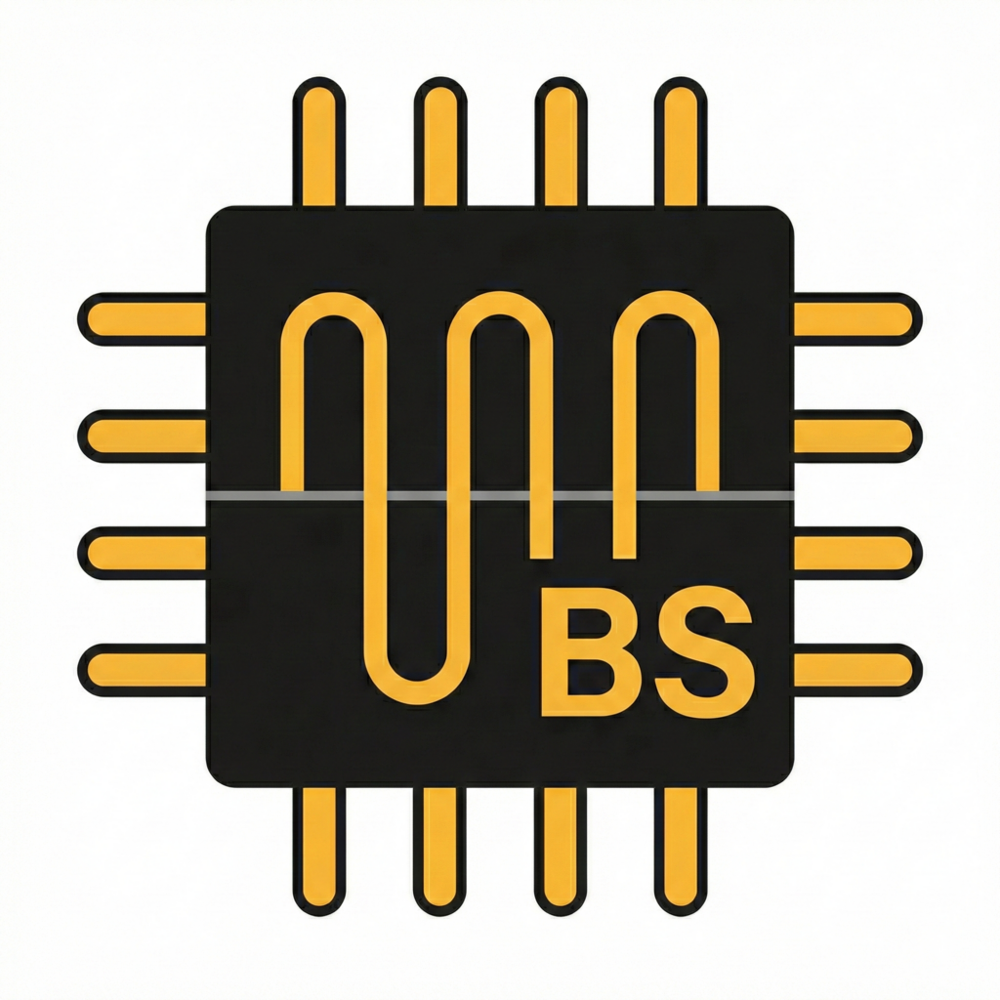
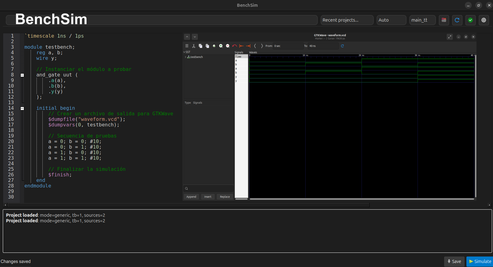

#  BenchSim

BenchSim is a desktop app (PyQt6 + QScintilla) to edit, compile, and simulate Verilog testbenches with Icarus Verilog (`iverilog` + `vvp`) and visualize waveforms in GTKWave.



## Key Features

- Dual workflow support: `Icestudio` and `Generic` Verilog projects.
- Auto source/testbench discovery (`Auto`, `Icestudio`, `Generic` modes).
- Fast simulation loop: `Save` + `Simulate` with compile/run logs.
- Clickable compile errors (`file:line:col`) to jump in the editor.
- Verilog-focused editor:
  - syntax highlighting,
  - autocomplete (keywords + document symbols),
  - find/replace,
  - adjustable font size (Settings, shortcuts, `Ctrl+Mouse Wheel`).
- Recent projects in the top toolbar.
- UI language support (`English`, `Español`).
- Built-in update checker via GitHub Releases.

## Requirements

- Python 3.8+
- Icarus Verilog (`iverilog`, `vvp`)
- GTKWave

## Quick Start (Development)

```bash
python -m venv .venv
source .venv/bin/activate
pip install -e .
benchsim
```

Alternative run command:

```bash
python -m benchsim.main
```

## Usage

### Icestudio projects

1. Export from Icestudio so `main.v` is generated under `ice-build/<project_name>/`.
2. Place your `*_tb.v` testbench in project root or in `ice-build/<project_name>/`.
3. Open the project folder in BenchSim.
4. If `ice-build` contains multiple projects, open a single project folder directly: `ice-build/<project_name>/`.

### Generic Verilog projects

1. Put DUT/source `.v` files and one or more `*_tb.v` files in the same folder.
2. Open that folder in BenchSim.
3. Select testbench and run simulation.

## Keyboard Shortcuts

- `Ctrl+S`: Save
- `Ctrl+R`: Simulate (auto-save + run)
- `Ctrl+Shift+V`: Validate project
- `Ctrl+O`: Open project folder
- `F5`: Reload project files
- `Ctrl+,`: Open settings
- `Ctrl+F`: Find
- `Ctrl+H`: Replace
- `F3` / `Shift+F3`: Find next / previous
- `Esc`: Close find/replace bar
- `Ctrl+Space`: Trigger autocomplete
- `Ctrl++` / `Ctrl+=`: Increase editor font size
- `Ctrl+-`: Decrease editor font size
- `Ctrl+0`: Reset editor font size
- `Ctrl+Mouse Wheel`: Zoom editor font in/out

## Packaging

### Build executable (PyInstaller)

```bash
source .venv/bin/activate
python -m PyInstaller packaging/pyinstaller/BenchSim.spec --noconfirm --clean
```

Output is generated in `dist/BenchSim/` (onedir). Distribute the full folder, not only the binary.

### Windows installer (Inno Setup)

```powershell
"C:\Program Files (x86)\Inno Setup 6\ISCC.exe" packaging\windows\BenchSim.iss
```

Installer output:

- `dist\installer\BenchSim-Setup-<version>.exe`

## Repository Layout

- `benchsim/`: app source code
- `benchsim/themes/`: UI/editor theme files
- `packaging/pyinstaller/`: PyInstaller spec
- `packaging/windows/`: Inno Setup installer script
- `packaging/linux/`: desktop entry template
- `sim_icon_package/`: icon assets
- `docs/screenshots/`: README screenshots
- `CHANGELOG.md`: release history
