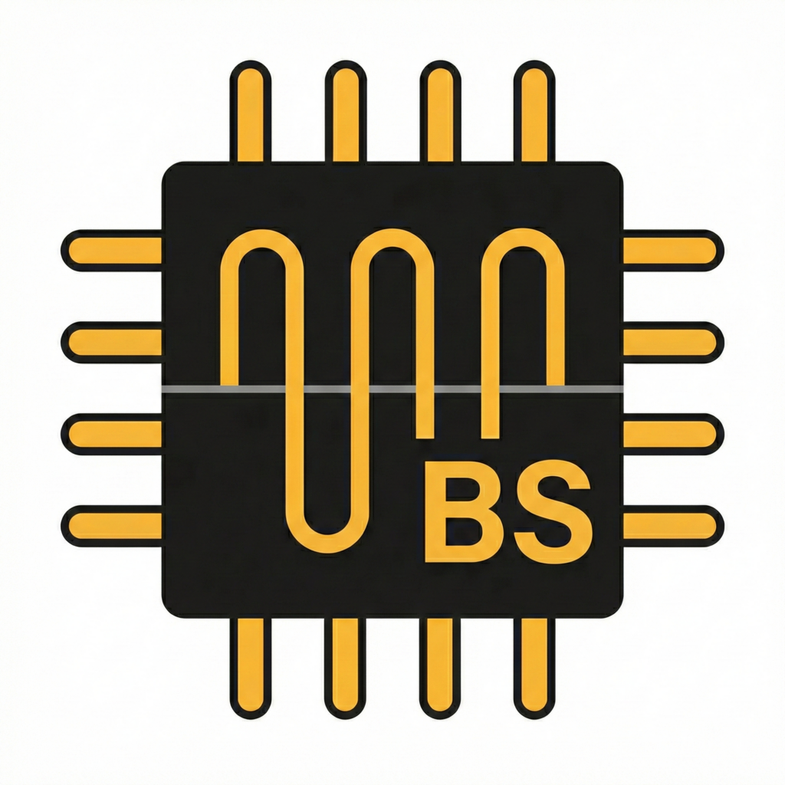
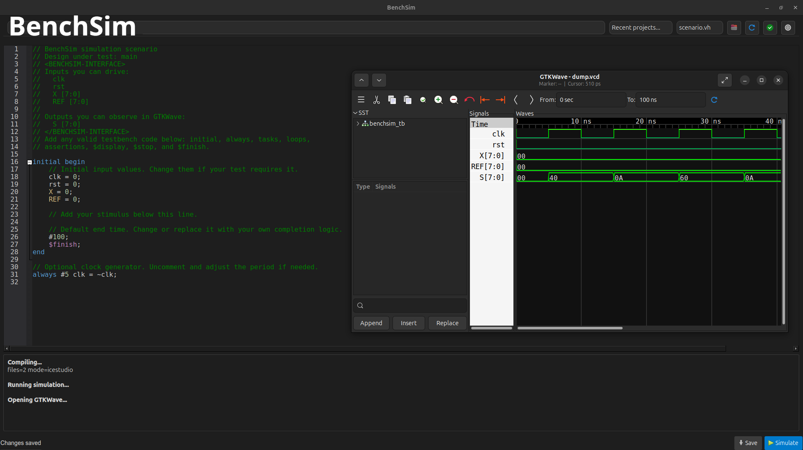

#  BenchSim [](https://github.com/lmcapacho/BenchSim/actions/workflows/ci.yml)

BenchSim is a desktop app (PyQt6 + QScintilla) to edit, compile, and simulate Verilog testbenches with Icarus Verilog (`iverilog` + `vvp`) and visualize waveforms in GTKWave.



## Key Features

- Direct project opening for Icestudio designs (`.ice`) and generic Verilog testbenches (`*_tb.v`).
- Icestudio workspace generation: BenchSim locates `ice-build/<design>/main.v` and creates an editable simulation scenario that survives design re-exports.
- Generic Verilog workflow with automatic source and testbench discovery.
- Fast simulation loop: `Save` + `Simulate` with compile/run logs.
- External testbench change detection with reload, local-edit protection, and safe merge support.
- Focused GTKWave view for generated Icestudio scenarios: direct inputs and outputs only, declaration order preserved, and a readable default profile.
- Clickable compile errors (`file:line:col`) to jump in the editor.
- Verilog-focused editor:
  - syntax highlighting,
  - autocomplete (keywords + document symbols),
  - find/replace,
  - adjustable font size (Settings, shortcuts, `Ctrl+Mouse Wheel`).
- Recent projects in the top toolbar.
- UI language support (`English`, `Español`).
- Built-in update checker via GitHub Releases.

## Requirements

- Python 3.8+
- Icarus Verilog (`iverilog`, `vvp`)
- GTKWave

## Quick Start (Development)

```bash
python -m venv .venv
source .venv/bin/activate
pip install -e .
benchsim
```

Alternative run command:

```bash
python -m benchsim.main
```

## Usage

### Icestudio projects

1. Build or export the design from Icestudio so it generates `ice-build/<design_name>/main.v`.
2. In BenchSim, open the design's `.ice` file with `Ctrl+O` or the toolbar open button.
3. BenchSim creates `ice-build/<design_name>/.benchsim/scenario.vh` and opens it in the editor.
4. Write input initialization and stimulus code in `scenario.vh`, then select **Save and Simulate**.

BenchSim generates `.benchsim/benchsim_tb.v` as an internal wrapper. Do not edit that file: it is regenerated from `main.v` whenever the Icestudio design is opened. The editable `scenario.vh` is preserved, including custom `initial` blocks, clocks, tasks, assertions, loops, `$display`, `$stop`, and `$finish` statements.

The scenario header lists only the design inputs that can be driven and outputs that are shown in GTKWave. Internal Icestudio implementation signals are intentionally hidden from the initial waveform view.

### Generic Verilog projects

1. Put DUT/source `.v` files and one or more `*_tb.v` files in the same folder.
2. Open the desired `*_tb.v` file in BenchSim.
3. Select testbench and run simulation.

### External file changes

When a testbench changes outside BenchSim, the editor asks whether to reload the external file or keep local edits. BenchSim keeps a local baseline to merge non-overlapping changes when possible. Save the resulting testbench after reviewing a merged change.

### GTKWave view

BenchSim writes a GTKWave save file after each successful simulation. For generated Icestudio scenarios, it displays the direct testbench interface in declaration order, avoiding the internal generated hierarchy. The bundled `gtkwave.rc` profile improves contrast and opens the complete simulation time range when supported by the installed GTKWave version.

## Keyboard Shortcuts

- `Ctrl+S`: Save
- `Ctrl+R`: Simulate (auto-save + run)
- `Ctrl+Shift+V`: Validate project
- `Ctrl+O`: Open an Icestudio design or Verilog testbench
- `F5`: Reload project files
- `Ctrl+,`: Open settings
- `Ctrl+F`: Find
- `Ctrl+H`: Replace
- `F3` / `Shift+F3`: Find next / previous
- `Esc`: Close find/replace bar
- `Ctrl+Space`: Trigger autocomplete
- `Ctrl++` / `Ctrl+=`: Increase editor font size
- `Ctrl+-`: Decrease editor font size
- `Ctrl+0`: Reset editor font size
- `Ctrl+Mouse Wheel`: Zoom editor font in/out

## Packaging

### Build executable (PyInstaller)

```bash
source .venv/bin/activate
python -m PyInstaller packaging/pyinstaller/BenchSim.spec --noconfirm --clean
```

Output is generated in `dist/BenchSim/` (onedir). Distribute the full folder, not only the binary.

### Windows installer (Inno Setup)

```powershell
"C:\Program Files (x86)\Inno Setup 6\ISCC.exe" packaging\windows\BenchSim.iss
```

Installer output:

- `dist\installer\BenchSim-Setup-<version>.exe`

## Repository Layout

- `benchsim/`: app source code
- `benchsim/themes/`: UI/editor theme files
- `benchsim/ice_project.py`: Icestudio discovery and generated simulation workspace
- `benchsim/tb_merge_controller.py`: external testbench merge support
- `benchsim/stimuli_persistence.py`: supported generic stimulus persistence
- `packaging/pyinstaller/`: PyInstaller spec
- `packaging/windows/`: Inno Setup installer script
- `packaging/linux/`: desktop entry template
- `sim_icon_package/`: icon assets
- `docs/screenshots/`: README screenshots
- `CHANGELOG.md`: release history
